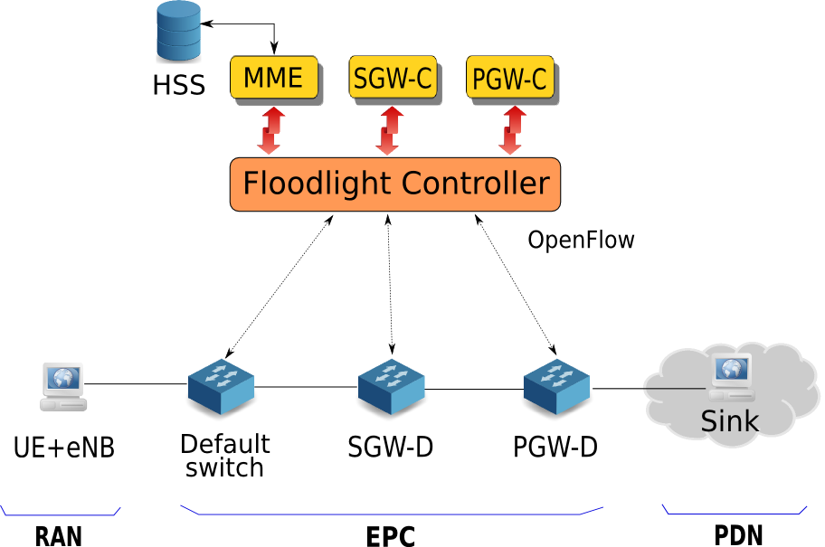

## SDN EPC User Guide

The manual contains all the steps to setup the SDN-based EPC. The entire setup (see Fig. 1) is primarily composed of the following components:

1. Floodlight controller
2. MySQL database (for HSS)
3. RAN simulator
4. Open vSwitch (for the gateways)
5. Sink program

<div align="center">

</div>
<p align="center">Fig. 1: SDN-based LTE EPC implementation</p>

#### Requirements ####

We need 6 machines in total to have the entire setup running. For the DefaultSwitch/SGW/PGW machines, we need **3 network interface cards** to connect the components as shown in Fig. 1.

Recommended specifications:
* Ubuntu 14.04 (64-bit)
* RAM: 4 GB

#### Controller Machine (MySQL and Floodlight) ####

1. Install MySQL database using the following command:<br/>
  ```
  $ sudo apt-get install mysql-server
  ```
  Give the username and password as `root` while installing. After successful installation, do the following:
  1. Login to MySql.

    `$ mysql -u root -p root`
  2. Create a database named *HSS.*

    `mysql> create database HSS;`
  3. Logout from MySql and run the following command from where the file HSS.sql is located (can be found under /src/controller/HSS).

    `$ mysql -u root -proot HSS < HSS.sql`
2. Download the dependencies for Floodlight: Floodlight master has been updated (on 04/30/16) to Java 8.
  * To download Java 8, run the following commands:
    ```
    $ sudo add-apt-repository ppa:webupd8team/java
    $ sudo apt-get update
    $ sudo apt-get install oracle-java8-installer
    ```

    To automatically set Java 8 environment variables, install the following package:<br/>
    ```
    $ sudo apt-get install oracle-java8-set-default
    ```
  * To download remaining dependencies for Floodlight master and above:<br/>
    ```
    $ sudo apt-get install build-essential ant maven python-dev eclipse libssl1.0.0/trusty libssl-dev/trusty openssl/trusty
    ```  
3. To download dependencies for Floodlight v1.2 and below:<br/>
    ```
    $ sudo apt-get install build-essential openjdk-7-jdk ant maven python-dev eclipse libssl1.0.0/trusty libssl-dev/trusty openssl/trusty
    ```
4. Download and build Floodlight: The below uses the master version of Floodlight. To use a specific version, specify the branch in the git step by appending -b &lt;branch-name&gt;.
    ```
    $ git clone https://github.com/floodlight/floodlight.git
    $ cd floodlight
    $ git submodule init
    $ git submodule update
    $ ant

    $ sudo mkdir /var/lib/floodlight
    $ sudo chmod 777 /var/lib/floodlight
    ```
5. Setting up Floodlight on Eclipse: The following command creates several files: Floodlight.launch, Floodlight_junit.launch, .classpath, and .project. From these you can setup a new Eclipse project.<br/>
    ```
    ant eclipse
    ```
    * Open eclipse and create a new workspace
    * **File -> Import -> General -> Existing Projects into Workspace**. Then click **Next**.
    * From **Select root directory** click **Browse**. Select the parent directory where you placed floodlight earlier.
    * Check the box for **Floodlight**. No other Projects should be present and none should be selected.
    * Click **Finish**.
6. Running Floodlight in Eclipse: Create the FloodlightLaunch target.
    * Click **Run->Run Configurations**
    * Right Click **Java Application->New**
    * For **Name** use **FloodlightLaunch**
    * For **Project** use **Floodlight**
    * For **Main** use ```net.floodlightcontroller.core.Main```
    * Click **Apply**
7. Creating modules for SDN EPC:
    * Expand the **floodlight** item in the Package Explorer and find the ```src/main/java``` folder.
    * Right-click on the ```src/main/java``` folder and choose **New/Package**.
    * Enter ```net.floodlightcontroller.sdnepc``` in the **Name** box and click on the **Finish** button. This creates a new package.
    * Copy the files Constants.java, ```MME.java, HSS.java, SGW.java, PGW.java``` and ```Utils.java``` and paste into the new package created.
8. Register the modules (```MME, SGW``` and ```PGW```):
    * First, we need to tell the loader that the modules exist. Append the following lines to the file `
    src/main/resources/META-INF/services/net.floodlightcontroller.core.module.IFloodlightModule`
    ```
      * net.floodlightcontroller.sdnepc.MME
      * net.floodlightcontroller.sdnepc.SGW
      * net.floodlightcontroller.sdnepc.PGW
    ```
    * Then, we tell the modules to be loaded. Append the above fully qualified module names separated by comma to the key *floodlight.modules* in the file ```src/main/resources/floodlightdefault.properties```.
9. Adding MySql adapter to the project:
  * Right-click floodlight **project->Build Path->Configure Build Path**.
  * Under the Libraries tab, click on **Add External JARs**.
  * Select the file ```mysql-connector-java-5.1.35-bin.jar``` (can be found under src/controller/hss) and click **OK**.

#### DefaultSwitch/SGW/PGW Machines (Open vSwitch) ####

Following needs to be done for setting up OVS on all the three machines. Run the scripts present in the respective directories.

1. Install Open vSwitch by running the script *install_ovs.sh* as superuser from the location of the file *openvswitch-2.3.2.tar.gz*.

  `# sh install_ovs.sh`
2. After every restart, you need to run the script *openvswitch.sh* as superuser.

  `# sh openvswitch.sh`
3. Run the script *config.sh* as superuser to create and connect the Open vSwitch to the floodlight controller.

  `# sh config.sh`
4. Run the script *repair.sh* as superuser to disconnect the switch from the controller.

  `# sh repair.sh`

#### RAN Machine (UE/eNodeB) ####

1. Install the dependencies using the following command:

  `sudo apt-get install openjdk-7-jdk iperf3 gcc g++ libssl1.0.0/trusty libssl-dev/trusty openssl/trusty`
2. Change the configurable parameters in the file *utils.h* according to your setup.

#### Sink Machine ####

1. Install the dependencies using the following command:

  `sudo apt-get install iperf3 gcc g++ libssl1.0.0/trusty libssl-dev/trusty openssl/trusty`

#### Setup configuration ####

Configure all the machines as shown in Fig. 2. For the Default Switch, SGW and PGW, the script *config.sh* adds the physical network interfaces, eth1 and eth2, as ports to the Open vSwitch. The numbers in red denote the port numbers of the OVSes. To get the port mappings of a switch, run the following command after running *config.sh*:

  `$ sudo ovs-ofctl show <bridge_name>`

If you have a different port mapping, then you need to change the port numbers in the controller file *Constants.java*.
<div align="center">

</div>
<p align="center">Fig. 2: Setup configuration</p>

#### Setup using containers ####

If you do not have enough number of physical machines, you can use containers for the entire setup on a single machine. Besides, this provides a much higher network bandwidth compared to physical hosts which generally have 1 Gbps NIC cards. We will use LXC (Linux Containers) to install each component of our setup. LXC is a fast, lightweight, and operating system-level virtualization technology that allows us to host multiple isolated Linux systems in a single host. We need 6 containers to host the 6 components shown in Fig. 3.

<div align="center">

</div>
<p align="center">Fig. 3: Setup configuration using containers</p>

We connect the containers using linux bridge. Besides, we don't need the ethernet switch in this setup since containers can be configured for multiple NICs. Following are the steps for setup:

  1. Install LXC on the host machine using the following commands:
    ```
    $ sudo apt-get install lxc lxctl lxc-templates
    $ sudo lxc-checkconfig
    ```

  2. Create 6 new containers with corresponding names for each component:
    ```
    $ sudo lxc-create -n ran -t ubuntu
    $ sudo lxc-create -n default_switch -t ubuntu
    $ sudo lxc-create -n sgw -t ubuntu
    $ sudo lxc-create -n pgw -t ubuntu
    $ sudo lxc-create -n sink -t ubuntu
    $ sudo lxc-create -n controller -t ubuntu
    ```

  3. To see the list of containers, run the following command:

    `sudo lxc-ls --fancy`

  4. Now, we configure the network interface of the containers including IP address, MAC address, MTU, etc. Note that, by default, all the containers are connected to a common linux bridge *lxcbr0* through the *eth0* interface. This is used for connecting the containers to the host machine. So, we don't touch this interface and instead, add our own interfaces according to our requirements on the various containers. We add 1 interface (*eth1*) to the *ran* and *sink* containers whereas 3 interfaces (*eth1, eth2, eth3*) to the remaining 4 containers. we do this by modifying the configuration file of the containers. Open the file `/var/lib/lxc/<container_name>/config` to see the configuration settings. We have provided a file named *config* in the respective directories of the components under "scripts/containers/lxc_config". Append the content of *config* to the configuration settings file of the respective container. We can also map specific CPU cores to the containers as well as allocate RAM to each container. The commands for setting this configuration are commented in the *config* files under the heading "Control group configuration". Uncomment and modify as per your requirements.

  5. We need to create linux bridges in order to connect the containers as per Fig. 3. The script *setup.sh* in the directory "scripts/containers" creates the required linux bridges. Since the bridges are not persistent, you need to run this script each time you restart the host machine.

  6. To start each container, use the following command:

  `sudo lxc-start -n <container_name> -d`

  We have provided the scripts *start.sh* and *stop.sh* under "scripts/containers" to start and stop all the containers respectively.

  7. Run the *lxc-ls* command (see Step 3) to verify the IP addresses of the containers.<br/>
  *Note:* If any of the containers is not showing the allocated IP addresses (assigned in the config file), you need to manually specify the same IP addresses statically in the file "/etc/network/interfaces" of the container.

  8. Now, we log into the containers using SSH. The default username and password is "ubuntu" We use eth0 IP address of the containers to login.

  `ssh ubuntu@<container_ip>`

  9. Since we require Eclipse for the controller, we need to install desktop environment on the controller container. Run the following command to install Unity desktop. This will take some time.

  `sudo apt-get install ubuntu-desktop`

  *Note:* The controller container will take more time (~ 2 minutes) to start compared to other containers because of the desktop environment.

  10. After setting up the containers, the same above mentioned steps can be followed to setup each component. Use the scripts under "scripts/containers" instead of the scripts for the general setup.

  *Note:* If you face problems while installing `iperf3` in the containers, use the following commands:
    ```
    $ sudo apt-get install software-properties-common
    $ sudo add-apt-repository "ppa:patrickdk/general-lucid"
    $ sudo apt-get update
    $ sudo apt-get install iperf3
    ```

#### How to run ? ####

1. Start the controller in eclipse using the run configuration specified above.

2. Start the OVS in DefaultSwitch/SGW/PGW by the running the script *openvswitch.sh* followed by *config.sh*. Note that you need not run *openvswitch.sh* if OVS is already running. Make sure that the switch connection notification for all the three switches is displayed in the controller console.

3. Start the sink program by running the script *sink.sh* under "src/sink".

    `$ sh sink.sh <sink_ip> <starting_port> <num_iperf3_servers>`

  If you want to simulate "Network-initiated Service Request", run the script *service_request.sh* instead.

    `$ sh service_request.sh <sink_ip> <starting_port> <num_servers>`

4. Start the RAN simulator using the following commands:
    ```
    $ make  
    $ sudo ./ran <num_ue> <simulation_time_in_min> <data_rate> [starting_port]
    ```
    
    *NOTE:*
    
    - Data rate should be specified as xK or xM where xK denotes 'x' Kbps and xM denotes 'x' Mbps.
    - Starting port parameter is optional. It denotes the starting port of the sink servers. Its default value is 13001. It should be same for both RAN and Sink.
    - The file *ran.cpp* has some boolean parameters `(setUpTunnel, doDetach, etc)` corresponding to various LTE procedures. These can be turned ON/OFF as per requirements of the procedure. For eg. for sending data, the variables `setUpTunnel, sendData` and `assignIpToInterface`, all should be set to **true**.
    - If you are facing the error `iperf3: error - the server is busy running a test` in the middle of simulation, then configure the following parameters in the file *utils.h*: `PER_THREAD_PORT_WINDOW` and `NUM_GLOBAL_PORTS`. Typical values can be 10 and 200 respectively. Depending on the values specified, the number of sink servers to be run will change as per the following formula:<br/><br/>
    `<num_iperf3_servers> = PER_THREAD_PORT_WINDOW * <num_ue> + NUM_GLOBAL_PORTS` <br/><br/>
    The error occurs when an iperf3 client tries to connect with a server on a port which was just closed by the previous client (socket close wait time).
    - Users have the option to print debug statements in both RAN and controller by setting the debug variables in the following files:
        - For RAN, set the variable *DO_DEBUG* to **1** in the file *utils.h*.
        - For controller, set the variable *DEBUG* to **true** in the file *Constants.java*.
